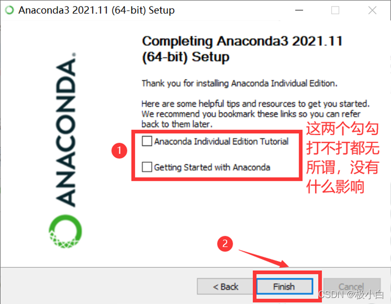

> [文档纠错/补充](https://github.com/dumengru/docs_codenotes/tree/master/docs/_docs)

---

## 下载安装包
- 以下两个地址均可下载, 如果官网下载速度较慢, 建议选用清华源, 下载最新版即可
1. [anaconda官网](https://www.anaconda.com/)
2. [清华大学开源软件镜像站](https://mirrors.tuna.tsinghua.edu.cn/anaconda/archive/)

## 安装注意事项
1. 记住自己的安装目录, 且安装路径不要有中文

2. 中间一步, 勾选添加到系统环境变量

3. 安装最后一步不要打勾

4. 重要的事情说三遍
- 安装完成后不要启动
- 安装完成后不要启动
- 安装完成后不要启动

## 安装成功验证
1. WIN+R键调出运行窗口，输入cmd回车
2. 输入conda, 出现以下界面即成功

## 踩坑点
1. 输入conda后提示"不是内部或外部命令", 大概率是漏勾选添加环境变量.(参考环境变量章节)
