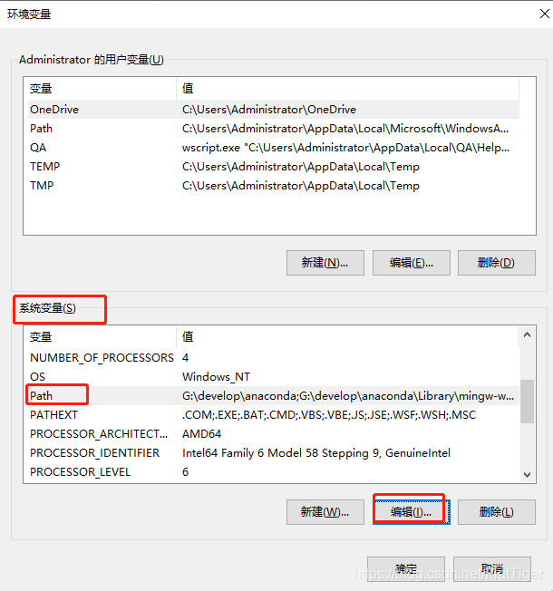

## 简介
环境变量可以简单理解为"快捷方式", 如果将某个路径配置到环境变量中, 就可以通过cmd窗口直接打开该路径下所有文件.

## 示例
以anaconda软件安装为例, 若安装时遗漏勾添加到系统环境变量中, 则需要安装后手动添加环境变量(卸载重装也可以)

1. 此电脑>右键>属性>高级系统设置, 点击环境变量
2. 选择系统变量中的path>编辑

3. 新建环境变量, 添加你的anaconda这几个路径

4. 保存退出, 重新打开cmd, 输入conda即可
- 实际上这里只不过是执行了anaconda目录下的conda.exe文件

## 提示
以后安装其他软件(比如python解释器)完成后发现在cmd界面无法执行命令, 基本都是环境变量没有配置好