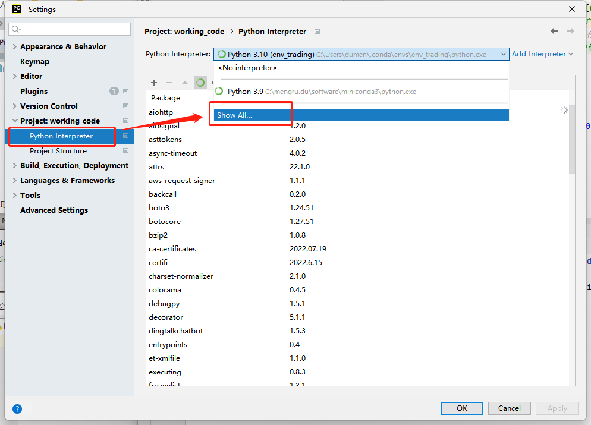
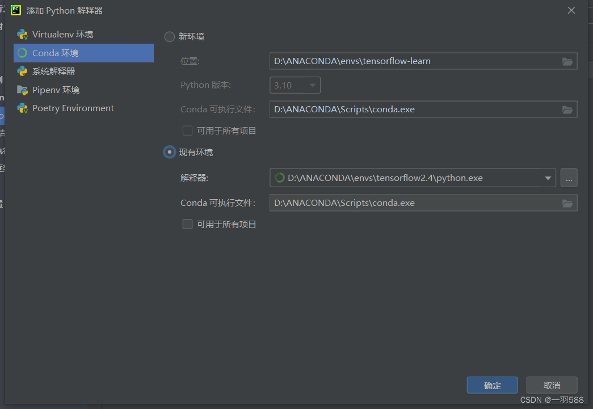

> [文档纠错/补充](https://github.com/dumengru/docs_codenotes/tree/master/docs/_docs)

---

## 下载软件 
- 下载社区版足够普通用户使用, 专业版需要收费

1. [pycharm官网](https://www.jetbrains.com/pycharm/download/#section=windows)

## 安装配置

#### 安装
1. 这个软件安装好像没什么坑, 直接安装然后启动即可

#### 配置
1. 启动pycharm, 点击左上角File -> Settings -> Python Interpreter -> Show All

2. 点击弹出框"+", 选择Conda Environment

- 右侧现有环境 -> 解释器: 填anaconda安装目录下的python.exe完整路径
- 右侧现有环境 -> Conda: 填anaconda安装目录下的Scripts/conda.exe完整路径
3. 保存并退出配置

#### 测试
1. 自己运行输出一个"hello world"程序
