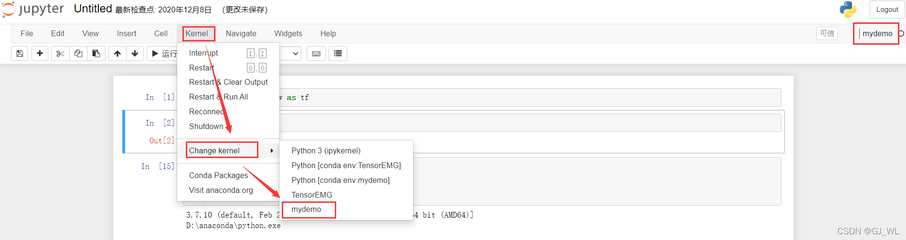

> [文档纠错/补充](https://github.com/dumengru/docs_codenotes/tree/master/docs/_docs)

---

## jupyter notebook

如果已经安装好conda, 直接在cmd窗口输入`jupyter notebook`, 就可以直接启动jupyter notebook. 注意在哪个文件夹下启动cmd, 默认jupyter notebook就会打开哪个文件夹

## jupyter配置conda虚拟环境

如果我们使用conda创建了多个虚拟环境, 在jupyter中运行代码时如何选择不同的虚拟环境呢


1. 在cmd界面激活env_new虚拟环境
`conda activate env_new`
2. 安装ipykernel, 执行`conda install ipykernel`
3. 将env_new环境写入jupyter, 名为mydemo, `python -m ipykernel install --user --name env_new --display-name mydemo`
4. 重新打开jupyter进行选择即可

## 其他命令

```python
# 查看所有的juypter kernel
jupyter kernelspec list

# 删除名为env_new的kernel
jupyter kernelspec remove kernelname
```